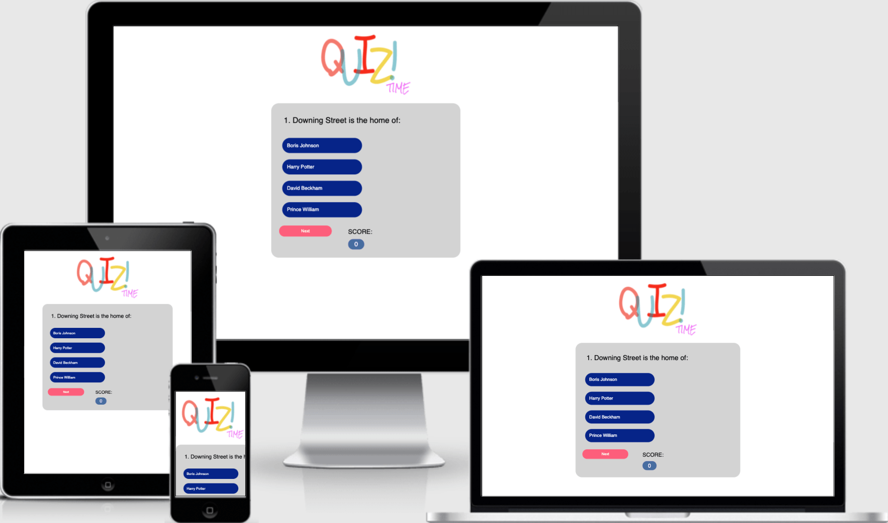
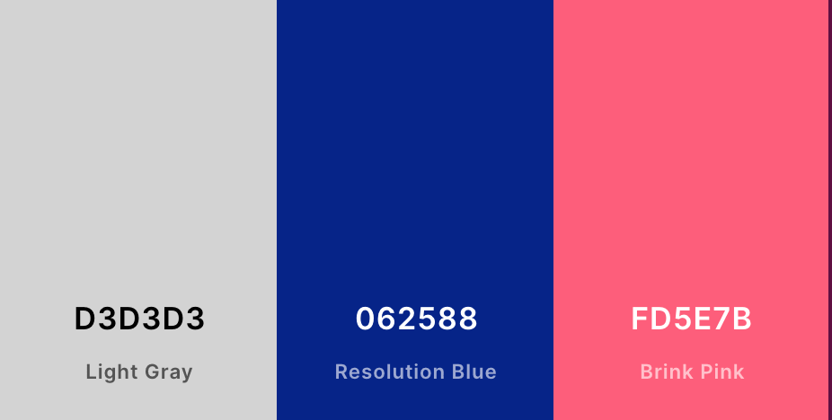
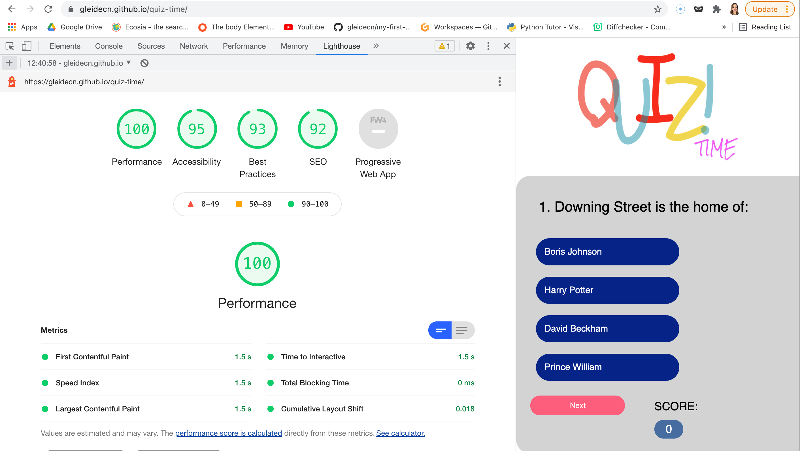
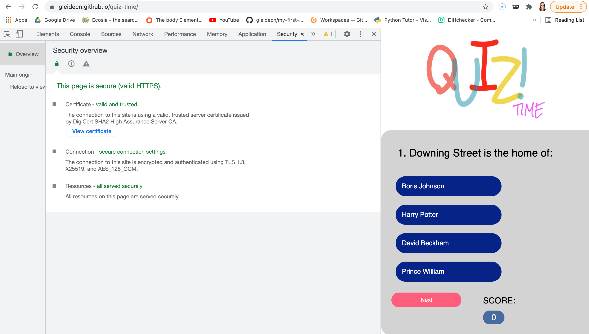
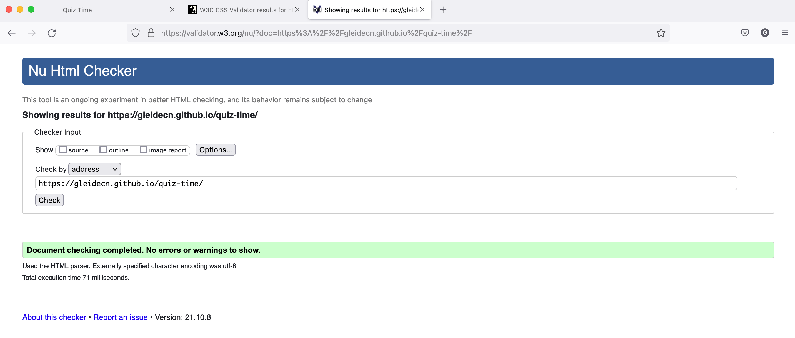
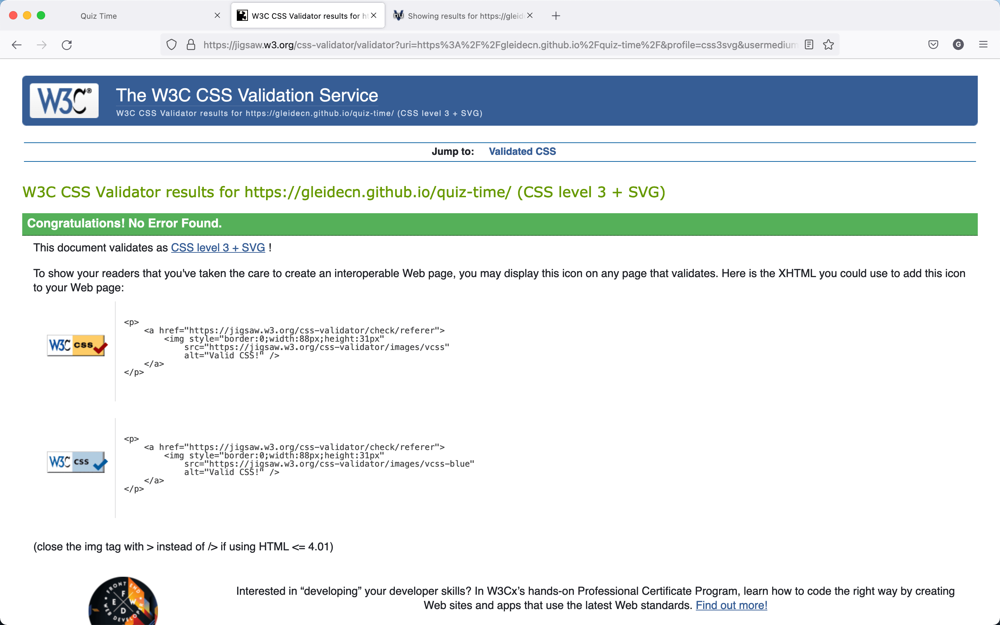
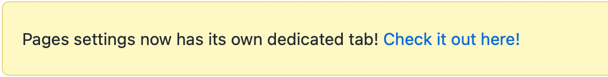
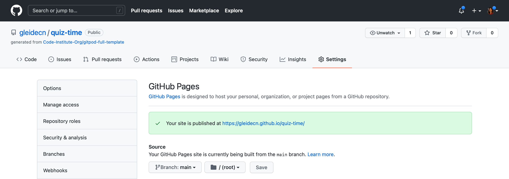

# Quiz Time 

[Live link](https://gleidecn.github.io/quiz-time/) 

 

QuizTime is a test of knowledge as well as a form of entertainment. It consists of a website with questions with multiple answers, only one of them is correct.
The user can only choose one answer from the four available. By clicking on the answers, the user finds out if it was right or wrong (green for correct and red for wrong) and counts one point per correct question. Then, clicking next and the process repeat till the end of questions. When the user completes all four questions, a score will appear showing how many answers they got right.

# Table of Contents

## [UX](UX)

- First Time Visitor Goals: 
    - As a first time visitor I need to be able to navigate the site easily and clearly understand how to use the function of the site.
    - The users will easily choose the options and go to the next question.
    - Once you finish playing refresh the page to try again.

- Returning Visitor Goals: 
    - I want they can recomemnd the site and have a kind of competition with his group to see who score more points.
    
## [Design](Desing)

- Colour Scheme: 

- Typography: 
    - I´ve used google fonts, this font was chosen as it looks modern and is easy to read.

- Layout 
    - The idea is to be a simple, easy and fun quiz. I like to use strong colors and a modern look.

## [Features](Features)
- Existing Features 
    - There are 4 possible answers to choose from. The selected answer will turn red if it is wrong and green if it is correct.
    - Each card shows in what questions the user is playing at the moment.
    - I the end of the quiz a total will show how many questions have been answered correctly.

- Future Features 
    - I want to add images to be more interactive with the users. Depending on their answer it will appear a different image.
    - I want to add a back bottom, for when the user finishes the quiz start again the quiz, without havingt o refresh the page.
    - I want to center all the bottoms from the questions.

## [Technologies Used](Technologies)

#### Languages: 
- HTML5
    - HTML5 markup language used for structuring and presenting content on the website, with emphasis placed on semantic elements and text alternatives for screen readers.
    
-  CSS
    - Is used to provide most of the styling for the website

- Javascript
    - JavaScript has been used to implement the site's interactive features, allowing the user to be interactive with the quiz.

### Tools:

- [Git](https://git-scm.com)
- Git was used for version control by utilizing the Gitpod terminal to commit to Git and Push to GitHub.
- [Github](https://github.com/gleidecn/quiz-time)
- GitHub is used to store the project's code after being pushed from Git.
- [Gitpod](https://gitpod.io/workspaces)
- This was my IDE for the project.
- [Google Lighthouse](https://developers.google.com/web/tools/lighthouse/) 
- [Security overview](https://8000-blue-dog-u2w0biqy.ws-eu18.gitpod.io/)
- [Nu Html Checker - HTML](https://validator.w3.org/nu/?doc=https%3A%2F%2F8000-blue-dog-u2w0biqy.ws-eu18.gitpod.io%2F)
- [W3C CSS](https://jigsaw.w3.org/css-validator/validator?uri=https%3A%2F%2F8000-blue-dog-u2w0biqy.ws-eu18.gitpod.io%2F&profile=css3svg&usermedium=all&warning=1&vextwarning=&lang=en)
- [Am I responsive](http://ami.responsivedesign.is) 
- [Online JavaScript Beautifier](https://beautifier.io)
- [Coolors](https://coolors.co/)
- [Compresspng](https://compresspng.com/)
- [Diffchecker](https://www.diffchecker.com/)

 ### Other Resources:

- [Code Institute Templates](https://github.com/Code-Institute-Org/gitpod-full-template) 
- [Google Font](https://fonts.google.com) - I´ve import the 'Montserrat' sans-serif
- [Slack](https://slack.com/intl/en-gb/) Huge thanks for the community, for all the helps.
- [Stackoverflow](https://stackoverflow.com)
- [W3School](https://www.w3schools.com/js/default.asp)
- [Google](https://google.com)
- [Ecosia](https://www.ecosia.org/)- [Google Font](https://fonts.google.com)
- [Firefox - Mozilla](https://www.mozilla.org/en-GB/firefox/new/)
- [CSS-Tricks](https://css-tricks.com/)
- [Mastering Markdown](https://guides.github.com/features/mastering-markdown/)

## [Testing](Testing)
- Testing was carried out both manually and automatically.

### Manual Tests:

    I check regularly to ensure that the results were as intended. I made use of developer tools within the browser constantly to check across a number of things. I would use the console tools to try out different ideas, particularly styling, to see how it worked in real time and then implement the code written there into the project itself. Responsiveness testing was done both through console tools, along with trying different browsers on different devices.

- I´ve performed the following checks:
-  Desktop and mobile:
    - Make sure content loads properly, and timely.
    - No erros in console log, or IDE.
    - Try differents users using differents methods as desktop, mobile and tablets.
    - Refresh the page when I was answering each questions so see the results.
    - All  tests were performed across multiple browsers and OS.

### Automated Tests:

- Performance and Accessiblilty:
[Google Lighthouse](https://developers.google.com/web/tools/lighthouse/)  
 

- [Security overview](https://8000-blue-dog-u2w0biqy.ws-eu18.gitpod.io/)

- [Nu Html Checker - HTML](https://validator.w3.org/nu/?doc=https%3A%2F%2F8000-blue-dog-u2w0biqy.ws-eu18.gitpod.io%2F)

- [W3C CSS](https://jigsaw.w3.org/css-validator/validator?uri=https%3A%2F%2F8000-blue-dog-u2w0biqy.ws-eu18.gitpod.io%2F&profile=css3svg&usermedium=all&warning=1&vextwarning=&lang=en)

- [Am I responsive](http://ami.responsivedesign.is) 
- This was used to check responsiveness on different screen sizes and create the showcase image for the project.

- [Online JavaScript Beautifier](https://beautifier.io)
- I used this tool to help format the javascript code 

## [Deployment](deployment)

### Creating Repository

 - I created the repository using the following steps:
 - I logged into my GitHub account and clicked the green button near the top left of the page displaying the text 'NEW'.
 - This took me to a page with the option to create a new repository. Under the repository template I clicked on the code institute template.
 - I chose a name for my repository and then clicked the create repository button.
 - I opened the new repository and clicked the green gitpod button to create a new workspace in Git Pod for writing and editing my code to develop the website.

### GitHub pages
- My project was deployed to GitHub pages using the following steps:

- In the IDE, ensure the tree is clean, and all required items have been committed and pushed to the repository in GitHub.
- Sign in to GitHub.
- Navigate to this repository: quiz-time
- From the repository menu, choose Settings. 
- From the menu setting scroll down to GitHub Pages click on Check it out here!
 
- The page will refresh, and the Pages section now shows a URL for the deployed site.
- Click the URL to view the live website. 
- Once the page has been created will look like this one below:
 
[Click here to see my Live Project](https://gleidecn.github.io/quiz-time/)

#### Forking the GitHub Repository
- Log in to GitHub and locate the [GitHub Repository](https://github.com/gleidecn/quiz-time)
- At the top of the Repository just above the "Settings" Button on the menu, locate the "Fork" Button and click.
- This will provide you with a copy of the original repository in your GitHub account.

#### Making a clone
- [GitHub Repository](https://github.com/gleidecn/quiz-time)
- At the top of the Repository just above the "Settings" Button on the menu, locate the "Fork" Button and click.
- This will provide you with a copy of the original repository in your GitHub account.

## [Credits](credits)

- [Code Institute](https://codeinstitute.net) For providing endless help and resources to get me this far.
- Thanks to Reuben Ferrante, my Code Institute mentor, for his guidance and insight.
- [Slack](https://slack.com/intl/en-gb/) Huge thanks for the community, for all the helps.
- [Coolors](https://coolors.co/)
- [W3School](https://www.w3schools.com/js/default.asp)
- [Compresspng](https://compresspng.com/)
- [Diffchecker](https://www.diffchecker.com/)
- [Git](https://git-scm.com)
- Javascript from - [Kindson The Tech Pro](https://www.youtube.com/watch?v=2Bpiluefkh8&t=548s)
- [Google Lighthouse](https://developers.google.com/web/tools/lighthouse/) 
- [Stackoverflow](https://stackoverflow.com)
- [CSS-Tricks](https://css-tricks.com/)
- [Google](https://google.com)
- [Ecosia](https://www.ecosia.org/)- [Google Font](https://fonts.google.com)
- [Firefox - Mozilla](https://www.mozilla.org/en-GB/firefox/new/)
- [Code Institute Templates](https://github.com/Code-Institute-Org/gitpod-full-template)
- [Mastering Markdown](https://guides.github.com/features/mastering-markdown/)